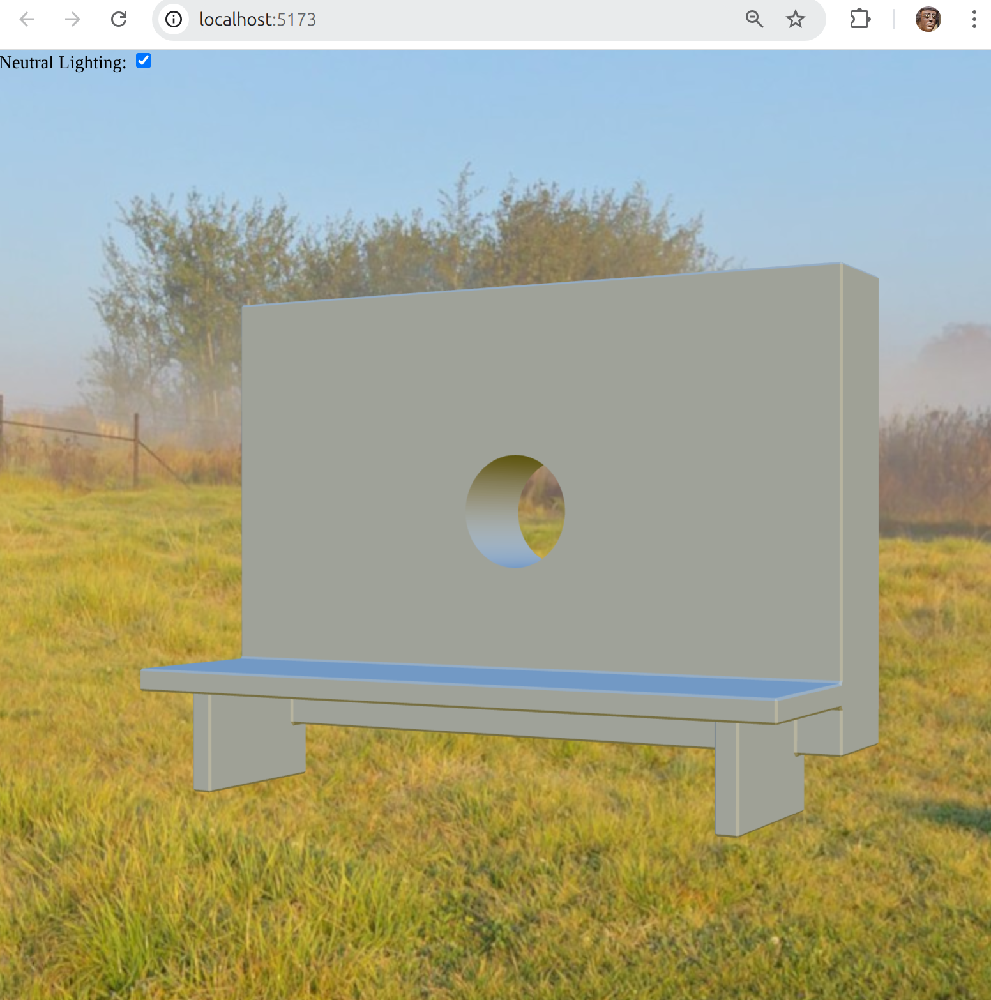

# Nice hot reload for CadQuery!

You don't need to bother with slow Jupyter server and other heavy things, just create geometry in any Python IDE convenient for you and immediately admire the result in your browser, even without reloading the entire page!

Use the powerful [\<model-viewer\> API](https://modelviewer.dev/docs/) to customization your scene environment.



## Install

```shell
git clone https://github.com/sundagy/cadquery-nice-hmr
```

## Setup

```shell
cd cadquery-nice-hmr
apt install python3.12
python3.12 -m venv venv
source venv/bin/activate
pip install -r requirements.txt
cd model-app
npm install
```

## Run

```shell
npm run dev
```


## Links

* [CadQuery](https://github.com/CadQuery/cadquery)
* [Cheatsheet](https://cadquery.readthedocs.io/en/latest/_static/cadquery_cheatsheet.html)
* [Examples](https://cadquery.readthedocs.io/en/latest/examples.html)
* [\<model-viewer\>](https://modelviewer.dev/)
* [Vite](https://vite.dev/)

